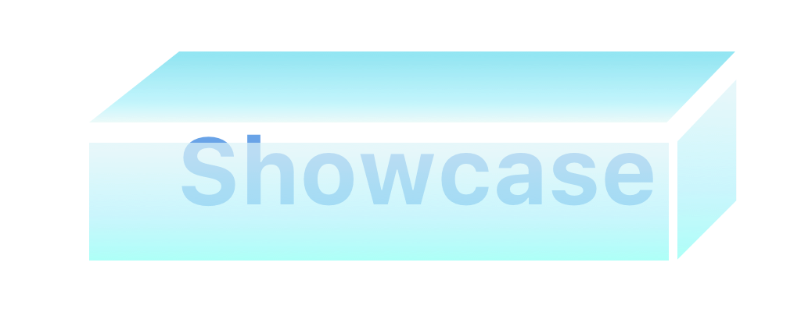
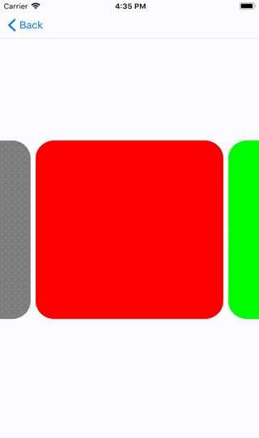
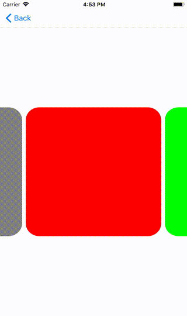
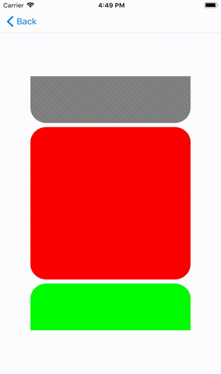
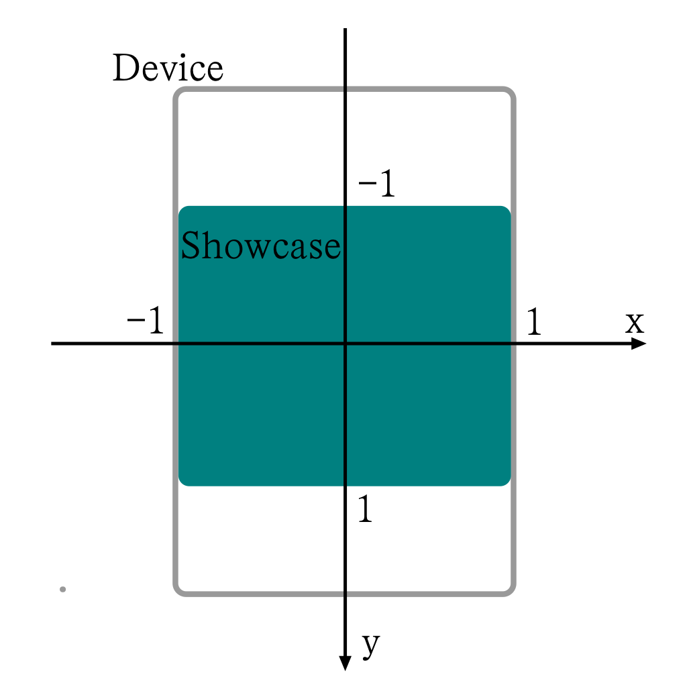
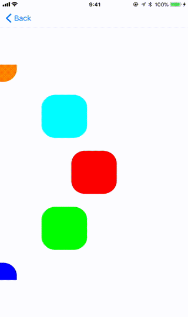
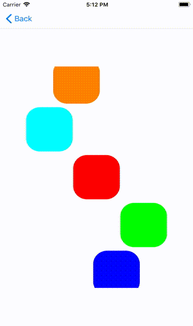
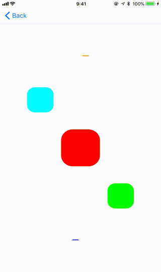
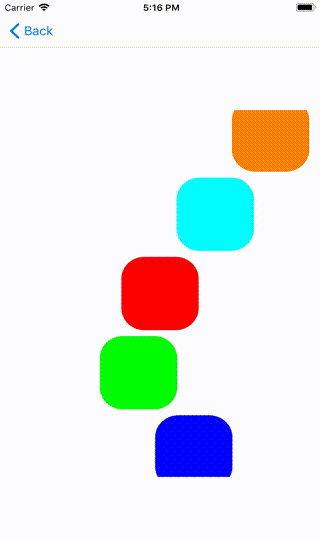
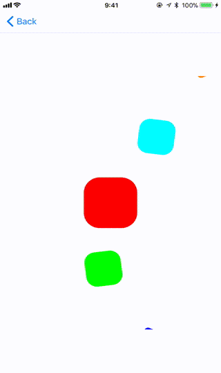

<p align="center">

</p>
<p align="center">


[](http://cocoapods.org/pods/Showcase)
[](http://cocoapods.org/pods/Showcase)
[](http://cocoapods.org/pods/Showcase)

## Basic Overview
Showcase is a UIView based view to display any views in the frame, like you display figures in a shelf or showcase.

## Feature
- Protocol based - Type-safe for view and model, does not require overriding any special view.
- Looping - Loop first cell to last cell or last cell to first cell being reused.
- Paging - Can enable showcase cell size paging.
- Layout - Customize your own layout.

## Installation

### [CocoaPods](https://cocoapods.org/)
Add the following to your Podfile:
```ruby
swift_version = '3.2'

use_frameworks!

target 'TargetName' do
 pod 'Showcase'
end
```

### [Carthage](https://github.com/Carthage/Carthage)
Add the following to your Package.swift:
```swift
let package = Package(
 name: "ProjectName",
 dependencies: [
  .Package(url: "https://github.com/h-yuya/Showcase.git", majorVersion: 3)
 ]
)
```

## How to Use
#### First, make a view you want to display and model are needed for configuration of the view  conform to `ReusableView` and `ReusableModel` protocol.
```swift
import UIKit
import Showcase

struct ColorModel: ReusableModel {
    let color: UIColor
    
    init(color: UIColor) {
        self.color = color
    }
}

final class ColorView: ReusableView {
    typealias Model = ColorModel
    
    func configure(with model: ColorModel) {
        backgroundColor = model.color
    }
 
    override func awakeFromNib() {
        super.awakeFromNib()
        configureAppearance()
    }
}

private extension ColorView {
    func configureAppearance() {
        layer.cornerRadius = 30
        clipsToBounds = true
    }
}
```
- `typealias Model`
   - `Model` is a model to configure the view
   - `typealias` it to any model conforming to `ReusableModel` .
   
-  `func configure(with model: Model)`
   - As its name suggests, configure the view with `Model`

#### Second, configure showcase in the ViewController.
```swift
import UIKit
import Showcase

final class ColorViewController: UIViewController {
    // UIView is the super class of Showcase
    @IBOutlet fileprivate weak var showcase: Showcase!
    fileprivate let colors: [UIColor] = [.red, .green, .blue, .yellow, .gray]
    
    override func viewDidLoad() {
        super.viewDidLoad()
        configure()
    }
}

private extension ColorViewController {
    func configure() {
        let models = colors.map(ColorModel.init(color:))
        
        showcase.layout.direction = .horizontal
        showcase.layout.itemSize = .init(width: 300, height: 300)
        
        // registered view is able to be used for resetting showcase.
        showcase.register(byNibName: ColorView.self)
        
        // Type-safely reset the showcase. You can call this method any number of times.
        // views used for resetting must be registered before resetting.
        showcase.reset(ColorView.self, models: models)
        
        // The type is used as the identifier for reuse
    }
}
```
#### Everything has done. Let's watch the demo.




Do you want to do paging with each view sizes?? 
OK, add just `showcase.isPagingEnabled = true` before resetting.




## Layout

Showcase have a layout property. You can design your layout easily.
These are all properties layout has.
### Showcase.layout
- `direction`: LayoutDirection      => .horizontal or .vertical
- `itemSize`: CGSize                   => item size
- `lineSpacing`: CGFloat             => spacing between each cell
- `path`: PathProtocol                 => path, view's orbit drawn by scrolling
- `transform`: TransformProtocol? => view's shape is transformed by scrolling

The Speciality is `path` and `transform` property.
### Definition & Feature of PathProtocol and TransformProtocol
```swift
public protocol PathProtocol {
    func normalizedPath(withCoordinate value: CGFloat) -> CGFloat
}
```
```swift
public protocol TransformProtocol {
    func transform(withScrollingRate rate: CGFloat) -> CATransform3D
}
```
- Normalized coordinate
- Can create your own designed path, conforming to PathProtocol

<p align="center">
    
</p>

Above, the blue-green area shows the frame of showcase. `path`, `transform` is normalized as
- The upper boundary of showcase = -1
- The lower boundary of showcase = 1
- The left boundary of showcase = -1
- The right boundary of showcase = 1

x-axis, y-axis are same direction as UIKit's coordinates' direction.

### Examples
Showcase provides 4 types of path.
- `DefaultPath` - moves on the x-axis, or y axis
- `CircularPath` - moves on the circular orbit
- `WavePath`- moves wavy
- `LinearPath`- moves linearly

and, 3 types of transform
- `TransformRotate` - rotation transform
- `TransformScale` - scale transform
- `TransformScaleRotate` - rotation and scale transform

#### DefaultPath
This `DefaultPath` is the default path of showcase.
```swift
public final class DefaultPath: PathProtocol {
    public func normalizedPath(withCoordinate value: CGFloat) -> CGFloat {
        return 0
    }
    
    public init() {}
}
```

Here, `x` is the x, y-coordinate when the showcase.layout.direction == .horizontal, .vertical.
The `normalizedPath` return 0 for all inputs. This indicates views are move on the axis, because 0 is on the axis in the normalized coordinate.

#### CircularPath & TransformRotate
`CircularPath` can be used for circular orbit.
```swift
public final class CircularPath: PathProtocol {
    public var normalizedRadius: CGFloat = 1
    public var normalizedOffset: CGFloat = -1
    public var offsetAngle: CGFloat = 0
    public var angle: CGFloat = .pi / 2
    
    public func normalizedPath(withCoordinate value: CGFloat) -> CGFloat {
        let theta = value * angle
        return normalizedRadius * cos(theta - offsetAngle) + normalizedOffset
    }
    
    public init() {}
}
```
```swift
public class TransformRotate: TransformProtocol {
    public var startRate: CGFloat = 0.2
    public var rotateAngle: CGFloat = 2 * .pi
    
    public func transform(withScrollingRate rate: CGFloat) -> CATransform3D {
        let canRotate = abs(rate) > startRate
        let optimizedRate = (rate + (rate < 0 ? startRate : -startRate))
        
        return CATransform3DMakeRotation(canRotate > rotateAngle * optimizedRate : 0, 0, 0, 1)
    }
    
    public init() {}
}
```

Here, the range [-1, 1] is converted to [-.pi / 2, .pi / 2]. After that, the cos() value of the range shows the circular coordinate.
When you use this path, create this path and replace `layout.path` with the value in the configuration function.

For TransformProtocol, [-1, 1] is the range of rate of scrolling. Apply it to the parameter you want to change with scrolling, here rotation angle is it.
Replace `layout.transform` on using.

Before showing example, I'll change the above configuration.
```swift
...
    //fileprivate let colors: [UIColor] = [.red, .green, .blue, .yellow, .gray]
    fileprivate let colors: [UIColor] = [.red, .green, .blue, .yellow, .gray, .purple, .orange, .cyan]
...

func configure() {
    let models = colors.map(ColorModel.init(color:))
    let path = CircularPath()
    let transform = TransformRotate()
    transform.startRate = 0.4
    transform.rotateAngle = 8 * .pi
    
    showcase.layout.direction = .vertical
    showcase.itemSize = .init(width: 100, height: 100)
    showcase.layout.path = path
    //showcase.layout.transform = transform
    
    showcase.register(byNibName: ShowView.self)
    showcase.reset(ShowView.self, models: models)
}
```



#### WavePath & TransformScale
`WavePath` can be used for wavy orbit.
```swift
public final class WavePath: PathProtocol {
    public var normalizedAmplitude: CGFloat = 0.5
    public var normalizedOffset: CGFloat = 0
    public var offsetAngle: CGFloat = 0
    public var angle: CGFloat = .pi / 2
    
    public func normalizedPath(withCoordinate value: CGFloat) -> CGFloat {
        let theta = value * angle
        return normalizedAmplitude * sin(theta - offsetAngle) + normalizedOffset
    }
    
    public init() {}
}
```
```swift
public class TransformScale: TransformProtocol {
    public var startRate: CGFloat = 0.8
    public var normalizedMinimumScale: CGFloat = 0.5

    public func transform(withScrollingRate rate: CGFloat) -> CATransform3D {
        let transformedRate = transformRange(withType: .centerPeak, rate: rate)
        let canScale = transformedRate < startRate
        let optimizedRate = max(transformedRate + (1 - startRate), normalizedMinimumScale)

        return CATransform3DMakeScale(canScale ? optimizedRate : 1, canScale ? optimizedRate : 1, 0)
    }

    public init() {}
}
```


The range[-1, 1] is converted to [-.pi / 2, .pi / 2], like `CircularPath`. Applying sin() function to input x, the orbit moves wavy.
Just change the above path and transform, like
```swift
let path = WavePath()
path.normalizedAmplitude = 0.5
path.angle = .pi

let transform = TransformScale()
transform.normalizedMinimumScale = 0.2

showcase.layout.path = path
showcase.layout.transform = transform
```



#### LinearPath & TransformScaleRotate
`LinearPath` can be used for linear orbit.
```swift
public final class LinearPath: PathProtocol {
    public var normalizedGradient: CGFloat = -0.5
    public var normalizedInversePosition: CGFloat?
    
    public func normalizedPath(withCoordinate value: CGFloat) -> CGFloat {
        switch normalizedInversePosition {
        case .some(let inverse):
            return value < inverse ? -normalizedGradient * value : normalizedGradient * (value - 2 * inverse)
            
        case .none:
            return normalizedGradient * value
        }
    }
    
    public init() {}
}
```
```swift
public class TransformScaleRotate: TransformProtocol {
    public var transformRotate: TransformRotate = .init()
    public var transformScale: TransformScale = .init()

    public func transform(withScrollingRate rate: CGFloat) -> CATransform3D {
        return CATransform3DConcat(transformRotate.transform(withScrollingRate: rate), transformScale.transform(withScrollingRate: rate))
    }

    public init() {}
}
```

`LinearPath` moves views linearly. Here, if you set `normalizedInversePosition`, the move will be inversed. So the movement will be like `V`.
Just change the above path and transform, like
```swift
let path = LinearPath()
path.normalizedInversePosition = 0.3
path.normalizedGradient = 0.8

let rotate = TransformRotate()
rotate.startRate = 0.4
rotate.rotateAngle = 8 * .pi
let scale = TransformScale()
scale.normalizedMinimumScale = 0.2
let transform = TransformScaleRotate()
transform.transformRotate = rotate
transform.transformScale = scale

showcase.layout.path = path
showcase.layout.transform = transform
```



Like here, transforms comformed to `TransformProtocol` can be concated with same scrolling rate.

## Summarize
1. Use `ReusableView` and `ReusableModel` to display views in `showcase`
2. Do you want to do paging with each cell size? Just use `showcase.isPagingEnabled = true`
3. Do you want to move views like you imagine? Showcase provides 4 different type of `path`.
4. If you create your own path, use `PathProtocol` and design it.
5. And `TransformProtocol` make view transformed.
6. Showcase is much customizable for `direction`, `itemSize`, `lineSpacing`, `isPagingEnabled`, `path`, `transform`
